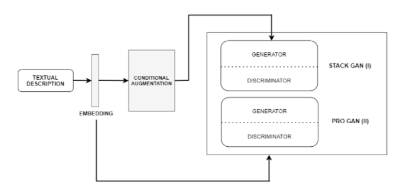

# MinorProject-Text2Face

## Title
Realistic Face Generation

## Base Paper Implementation
[StackGAN: Text to Photo-realistic Image Synthesis with Stacked Generative Adversarial Networks](https://arxiv.org/abs/1612.03242)

## Problem Statement
Although Conventional GANs have shown remarkable success in various tasks, they still face a lot of challenges in generating high quality images since generator and discriminator use the same backpropagation network. So, through this paper, we aim at generating realistic faces using a fully-trained GAN on different datasets.

## Application Areas
- Movie Actors Casting
- Criminal face reconstruction
- Identification of victims for law agencies
- Image editing/Video games

## Achitecture Diagram

## Software/Hardware Requirements:

### Software:
Language: Python
Framework: PyTorch/Tensorflow
Libraries: numpy, image_processing, scipy, matplotlib, pickle etc.
Operating System: Windows7 (minimum)

### Hardware:
RAM: 8GB (min.)
Processor: core i5 or i7
HDD/SDD: SDD preferred (faster)
Graphic Card
GPU (might require later)

## Team Members:
Anukriti, DTU
Anurag Mudgil, DTU
Nakul Dodeja, DTU